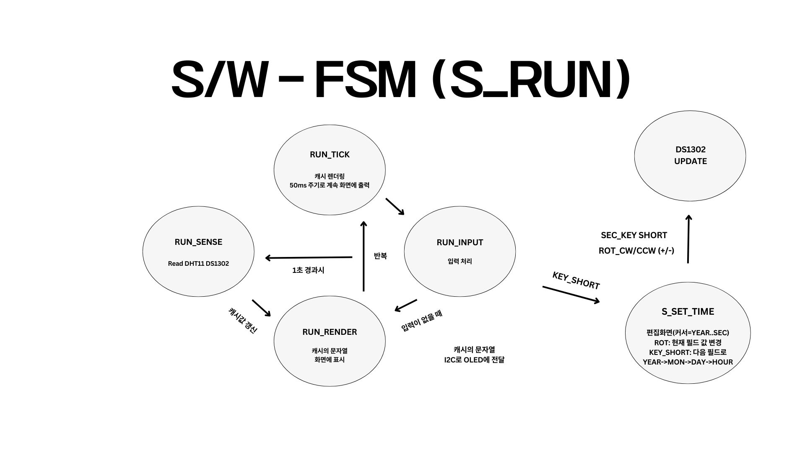
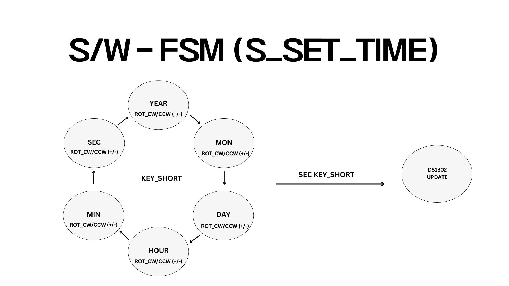

# Linux Device Driver Project  
DS1302 · DHT11 · OLED · Rotary Encoder 통합 디바이스 드라이버

Linux 커널 디바이스 드라이버를 직접 구현하여  
RTC, 온·습도 센서, OLED 디스플레이, 로터리 엔코더를 하나의 시스템으로 통합한 프로젝트입니다.  
사용자 공간 애플리케이션 없이 커널 내부에서 입력 처리, 센서 제어, 화면 출력을 수행하도록 설계되었습니다.

---

## 📌 프로젝트 개요

본 프로젝트는 Linux 커널 디바이스 드라이버 구현을 통해  
하드웨어 제어, 인터럽트 처리, 통신 프로토콜(I2C)을 다루고 이해하는 것을 목표로합니다.

DS1302 RTC와 DHT11 센서를 활용해 시계 및 온·습도 정보를 OLED에 출력하고,  
로터리 엔코더 입력을 통해 시간 보정이 가능한 시스템을 구현하였습니다.

---

## 🎯 프로젝트 목표

- DS1302 RTC 기반 시계 기능 구현
- DHT11 센서를 이용한 온·습도 측정 및 표시 
- OLED(I2C) 디스플레이 출력
- 로터리 엔코더를 이용한 시간 설정 UI 구현

---

## 🧩 하드웨어 구성
- Raspberry Pi 4B  
- DS1302 RTC Module  
- DHT11 Temperature & Humidity Sensor  
- OLED 128x64 (I2C)  
- Rotary Encoder Module  

---

## ⚙️ 시스템 동작 방식

커널 모듈 로드 후 시스템은 자동으로 동작합니다.

- **S_RUN 상태(기본 시계 화면)**
  - 1초 주기로 DS1302 및 DHT11 값을 읽어 캐시에 저장
  - 50ms 주기로 OLED 화면 갱신
  
- **S_SET_TIME 상태(시간 편집 모드)**
  - 로터리 엔코더 회전으로 시간 값 증가/감소
  - 버튼 입력으로 편집 필드 이동 및 설정 완료
  

모든 입력은 GPIO 인터럽트 기반으로 처리되며,  
FSM 구조를 통해 안정적인 UI 흐름을 유지합니다.

---

## 🔍 주요 드라이버 설명

### 1️⃣ DHT11 Driver
- GPIO bit-banging 방식으로 us 단위 타이밍 프로토콜 구현
- 40bit 데이터 수신 후 checksum 검증
- 커널 내부에서 온·습도 값 제공

### 2️⃣ Rotary Encoder Driver
- 신호 상태 변화 순서를 통해 회전 방향 판별
- ROT_EV_CW / ROT_EV_CCW 이벤트 생성 및 DS1302 모듈에 전달 

### 3️⃣ DS1302_OLED Driver
- RTC와 OLED를 결합한 통합 디바이스 드라이버
- Workqueue 기반 `tick_fn()`으로 주기 처리
- FSM 기반 UI 렌더링 및 입력 처리 수행

---

##  🎬 동작 영상 (Demo)
본 프로젝트의 실제 동작 모습은 아래 영상을 통해 확인할 수 있습니다.
(시계 동작, 온·습도 표시, 로터리 엔코더를 이용한 시간 설정 기능 포함)

https://github.com/user-attachments/assets/5dc46495-3a4e-48c7-8425-b6e0b3cd3425

---
## 🛠️ 사용 기술

## 🚧 Trouble Shooting

### 로터리 엔코더 입력 오동작 문제

- **문제**  
  ds1302_oled 모듈 연동 시 회전 방향이 반대로 인식되거나 입력이 누락됨
- **원인**  
  S1만 인터럽트로 사용하면서 S2 샘플링 타이밍이 불안정해짐
- **해결**  
  S1/S2 모두 인터럽트로 처리하고 상태 변화 순서 기반 판별 방식 적용

---

## ✅ 프로젝트 결과

- 커널 내부에서 입력·센서·디스플레이를 통합 제어하는 시스템 구현
- 인터럽트 및 타이밍 기반 드라이버 설계 경험
- 모듈 간 연동을 고려한 구조적 커널 설계 이해

---

